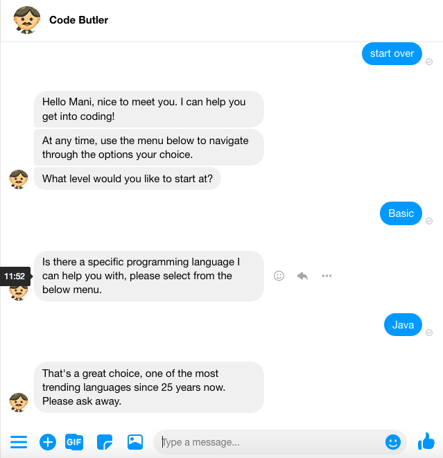
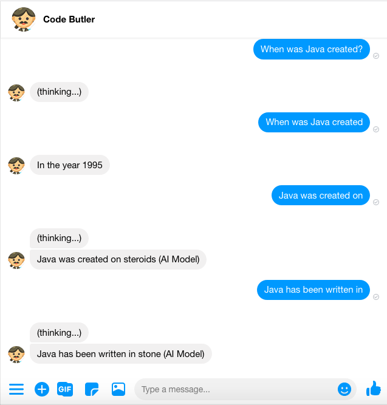

# Code Butler bot

Code Butler is bot that assits learning about coding and programming languages in a fun way, created to showcase key features of the Messenger Platform. Code Butler leverages key features to deliver a great learning experience.

[Access the Messenger experience](https://m.me/CodeButler?ref=GITHUB)

 

# Setting up your Messenger App

## Requirements

- **Facebook Page:** Will be used as the identity of your messaging experience. When people chat with your page. To create a new Page, visit https://www.facebook.com/pages/create.
- **Facebook Developer Account:** Required to create new apps, which are the core of any Facebook integration. You can create a new developer account by going to the [Facebook Developers website](https://developers.facebook.com/) and clicking the "Get Started" button.
- **Facebook App:** Contains the settings for your Messenger automation, including access tokens. To create a new app, visit your [app dashboard](https://developers.facebook.com/apps).

## Setup Steps

Before you begin, make sure you have completed all of the requirements listed above. At this point you should have a Page and a registered Facebook App.

**Before going through the below steps, please watch this video on [How to create a Messenger Bot](https://www.youtube.com/watch?v=4NG2WqLYV-A), it will help with the below steps.**

#### Get the App id and App Secret

1. Go to your app Basic Settings, [Find your app here](https://developers.facebook.com/apps)
2. Save the **App ID** number and the **App Secret**

#### Grant  Messenger access to your Facebook App

1. Go to your app Dashboard
2. Under Add Product find Messenger and click Set Up
3. Now you should be in the App Messenger Settings
4. Under Access Tokens, click on Edit Permissions
5. Select the desired page and allow Manage and access Page conversations in Messenger
6. Select the desired page and an access token should appear
7. Get the Page ID from the page access token by using the [Access Token Debugger](https://developers.facebook.com/tools/debug/accesstoken/)
8. In the section Built-In NLP, select your page and enable the toggle

# Installation

Clone this repository on your local machine:

```bash
$ git clone git@github.com:neomatrix369/code-butler-app.git
$ cd code-butler-app
```

You will need:

- [Node](https://nodejs.org/en/) 10.x or higher
- [Localtunnel](https://github.com/localtunnel/localtunnel) or remote server like [Heroku](https://www.heroku.com/)
- [Python](https://python.org/) 3.7 or higher

# Usage

## Using Local Tunnel

#### 1. Install the dependencies

```bash
$ cd model-server
$ pip install -r requirements.txt
$ wget https://dl.fbaipublicfiles.com/fairseq/models/roberta.large.tar.gz
$ tar xvzf roberta.large.tar.gz
$ rm roberta.large.tar.gz
```

```bash
$ cd ..
$ cd app-server
$ npm install
```

#### 2. Install Local Tunnel
```bash
npm install -g localtunnel
```

Open a new terminal tab and request a tunnel to your local server with your preferred port
```bash
lt --port 3000
```

#### 3. Rename the file `.sample.env` to `.env`

```bash
mv .sample.env .env
```

 Edit the `.env` file to add all the values for your app and page. Then run your app locally using the built-in web server

#### 4. Run your app locally using the built-in web server<

```bash
$ cd model-server
$ FLASK_ENV=development FLASK_APP=flask-torch-app.py flask run
```

Run the above ML server, in order to be able to send questions to the ML server and get an answer (if it can return one) with confidence scores. The server will stand up at [http://localhost:5000](http://localhost:5000) for REST API calls -- meant for internal use to the Chat app only.

Open a new terminal session and run the below commands:

```bash
$ cd app-server
$ node app.js
```

You should now be able to access the application in your browser at [http://localhost:3000](http://localhost:3000)


#### 5. Configure your webhook subcription and set the Messenger profile

Use the `VERIFY_TOKEN` that you created in `.env` file and call the **/profile** endpoint like so:
```
http://localhost:3000/profile?mode=all&verify_token=verify-token
```

#### 6. Test that your app setup is successful

Send a message to your Page from Facebook or in Messenger, if your webhook receives an event, you have fully set up your app! Voilà!

## Using Heroku
#### 1. Install the Heroku CLI

Download and install the [Heroku CLI](https://devcenter.heroku.com/articles/heroku-cli)

#### 2. Create an app from the CLI

```bash
git init
heroku apps:create
# Creating app... done, ⬢ mystic-wind-83
# Created http://mystic-wind-83.herokuapp.com/ | git@heroku.com:mystic-wind-83.git
```

#### 3. Deploy the code
```bash
git add .
git commit -m "My first commit"
git push heroku master
```

#### 4. Set your environment variables
  In your Heroku App Dashboard [https://dashboard.heroku.com/apps/mystic-wind-83](https://dashboard.heroku.com/apps/mystic-wind-83) set up the config vars following the comments in the file ```.sample.env```

#### 5. Configure your webhook subscription and set the Messenger profile
  You should now be able to access the application. Use the ```VERIFY_TOKEN``` that you created as config vars and call the **/profile** endpoint like so:

  ```
  http://mystic-wind-83.herokuapp.com/profile?mode=all&verify_token=verify-token
  ```

#### 6. Test that your app setup is successful

  Send a message to your Page from Facebook or in Messenger, if your webhook receives an event, you have fully set up your app! Voilà!

## License
Messenger App Code Butler is BSD licensed, as found in the LICENSE file.

See the [CONTRIBUTING](CONTRIBUTING.md) file for how to help out.